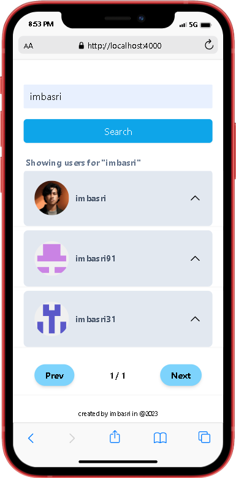
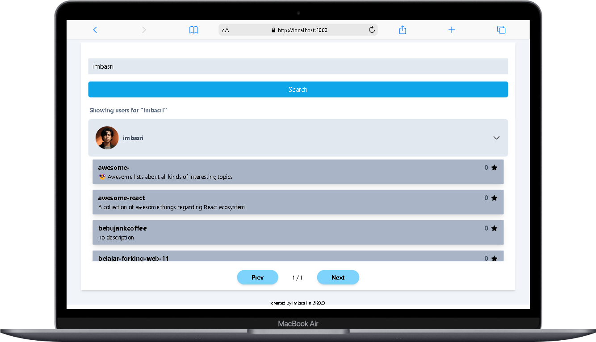
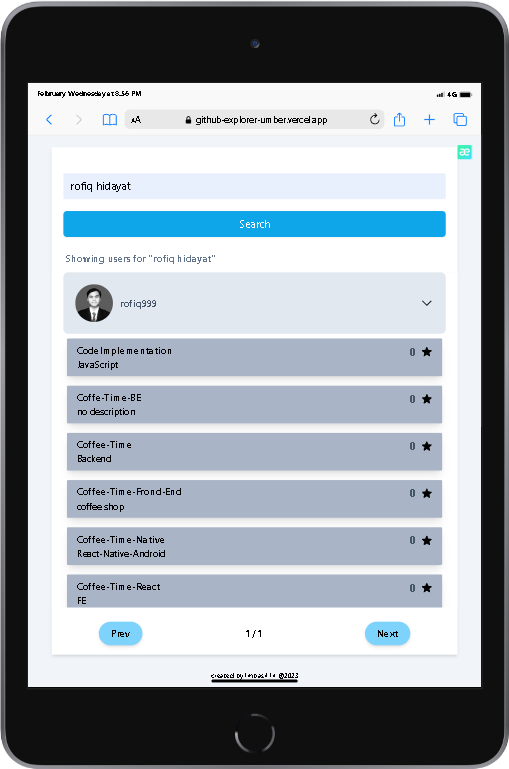
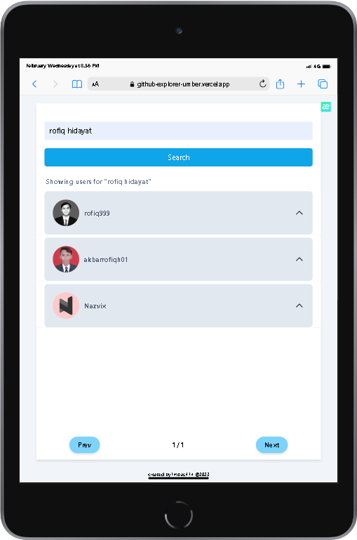

<main>

<h1 align="center"><u>Github Repository Expl🌍rer</u></h1>

<h2>Built with</h2>

 

## Table of Contents

-  [Introduction](#introduction)
-  [Features](#features)
-  [Requirements](#requirements)
-  [Usage](#usage-for-development)
-  [Screenshots](#screenshots)
-  [Related Project](#related-project)

## Introduction

<h3>Github Repository Explorer</h3>

You can search for repository data from this web app, it's very simple to use.

Github Explorer [`here`](https://github-explorer-umber.vercel.app/)

## Features

-  Search
-  Get Repository
-  See Star
-  Open to newtab Repo
-  And others

## Requirements

## Usage for development

1. Open your terminal or command prompt.
2. Type `git clone https://github.com/imbasri/github-explorer.git`
3. Open folder with your text editor.
4. Start to edit and development.

## Screenshots App

<table border="2">
    

        
        
        
        
          
          
    

</table>

## Related Project

-  Frontend Deploy [`here`](https://github-explorer-umber.vercel.app/)

<b>&copy;2023 @imbasri☕</b>

</main>
